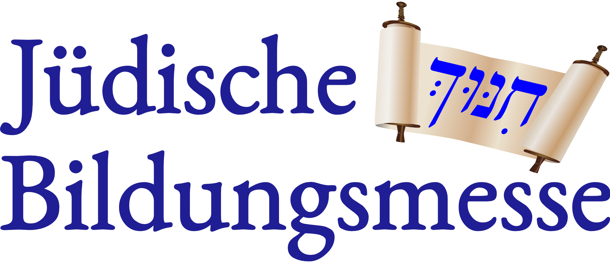

# Jüdische Bildungsmesse

## Idee

**Die Jüdische Bildungsmesse bringt jüdische Bildungseinrichtungen und Organisationen aller Art zusammen in einer gemeinsamen Plattform um eine öffentliche Wahrnehmung für jüdische Bildung und ihre Angebote zu fördern.**

Kennen Sie alle jüdischen Bildungseinrichtungen in Ihrer Stadt?

Wie viele jüdische Schulen und Kindergärten gibt es in Ihrer Stadt?

Welche Bildungsangebote gibt es für Senioren oder Jugendliche?

Wie bilden Kinder, die staatliche Schulen und Kitas besuchen, eine jüdische Identität aus?
Es gibt eine große Anzahl an jüdischen Bildungseinrichtungen, doch kaum einer kennt sie alle. Die große Vielfalt an jüdischer Bildung findet sich auch nicht in einem Verzeichnis oder über eine einzige Trägerorganisation.

Das Ziel des Projekts ist die jährliche Durchführung der Jüdischen Bildungsmesse in Berlin. Jüdische Bildungseinrichtungen und Organisationen jeder Art können ihre Angebote im Bereich jüdischer Bildung der Öffentlichkeit präsentieren. Somit wird eine gemeinsame Plattform geschaffen, was allen Einrichtungen ermöglicht, sowohl ihre Arbeit dem Publikum vorzustellen als auch neue Nutzer und Mitglieder zu finden. 

Auf einem die Messe begleitenden Fachkongress wird die Möglichkeit zum Treffen und Austausch zwischen den Bildungseinrichtungen gegeben.

Die Messe soll jährlich stattfinden und damit einen festen Orientierungspunkt zum Thema jüdische Bildung anbieten. Der Zeitpunkt sollte sich nach den Einschreibefristen in Schulen und Universitäten richten, so dass Interessierte sich mit Hilfe der Bildungsmesse optimal informiert für die eine oder die andere Bildungseinrichtung entscheiden.

Die Jüdische Bildungsmesse wird sich durch einen hohen Grad der Transparenz und Einbeziehung der Öffentlichkeit auszeichnen. Die Messe ist nicht nur an die Mitglieder der jüdischen Gemeinden und Synagogen gerichtet, sondern wird hauptsächlich zum Zwecke der Informierung der breiten Öffentlichkeit über die bereits existierende große Bandbreite der jüdischen Bildungsangebote organisiert.
Die Jüdische Bildungsmesse ist ein Non-Profit-Projekt, welches überwiegend Kostendeckung anstrebt und hauptsächlich mit Hilfe von Sponsoren realisiert werden soll.

## Archiv

Früher gab es hier auch eine Liste der jüdischen Bildungseinrichtungen in Deutschland und weitere Inhalte. Da wir diese nicht regelmäßig pflegen können, findet sie sich nur noch im [Internet Archiv](https://web.archive.org/web/20180828081349/http://www.juedische-bildungsmesse.de/bildungseinrichtungen).

## Aktueller Stand

**Wir haben ein Grobkonzept (s.u.) erstellt und sind auf der Suche nach Sponsoren und Organisationen, die die Idee aufgreifen und umsetzen möchten.**

**Bei Interesse bitten wir um Kontaktaufnahme per Email unter info@juedische-bildungsmesse.de.**

## Grobkonzept

### Jüdische Bildungsmesse

* Für alle jüdischen Bildungseinrichtungen der Region
* Für alle Alters- und Zielgruppen
* Organisationen stellen sich vor
* “Kunden” informieren sich 
* Messecharacter mit Tischen/Ständen
* Kostenfrei für Aussteller und Besucher
* Ggf. mit Verkaufsständen für Essen, Bücher, Paraphernalia
* Gleiche Bedingungen (Standgröße usw.) für alle Organisationen

### Organisation

* Gemeinnütziger Träger richtet aus, z.B. inter-konfessioneller Partner
* Sponsoren stellen bereit bzw. finanzieren
  * Räumlichkeiten
  * Tische, Stühle, Stände
  * Werbematerialen
  * Programmhefte, Poster und Plakate
  * T-Shirts
  * etc
* Prominente Schirmherrschaft
* 1 bezahlte Organisationskraft (3 Monate Arbeit über 6-9 Monate verteilt)
* Ehrenamtliche Helfer im Orga-Team
  * Vorbereitung
  * Programmkommittee
  * Aufbau/Abbau
  * Betreuung während der Veranstaltung
  * Pressearbeit
* Verkaufsstände beteiligen sich an den Kosten
* Werbung und rechtzeitige Kommunikation beachten
* Im ersten Jahr extrem einfach gehalten und dadurch kostengünstig

### Warum Berlin?

* Berlin hat sehr große Tradition in jüdischer Bildung
* Berlin als jüdische Stadt sichtbarer machen
* Jüdisches Leben = Bildung
* Familien anlocken, die für die Bildungsangebote umziehen
* Berlin = Hauptstadt der Politik, Bildung ist immer ein positives Thema
* Jüdische Identität über Bildung stärken
* Bildung als Thema vereint unterschiedliche Strömungen
* Gesunden Wettbewerb fördern
* Den Austausch zwischen den Organisationen und die Kooperation fördern

### Transparenz

* Organisation Durchführung der jüdischen Bildungsmesse möglichst transparent und offen
  * Planung einsichtbar (diese Webseite)
  * Finanzielle Beteiligung und Interessen nachvollziehbar
* Vorbeugen von Parteinahme oder Benachteiligung
* Mehr Spenden einwerben können, wenn jeder sehen kann, wofür das Geld ausgegeben wird
* Ausnahme sind sicherheitsrelevante Details
